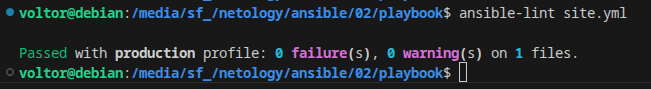
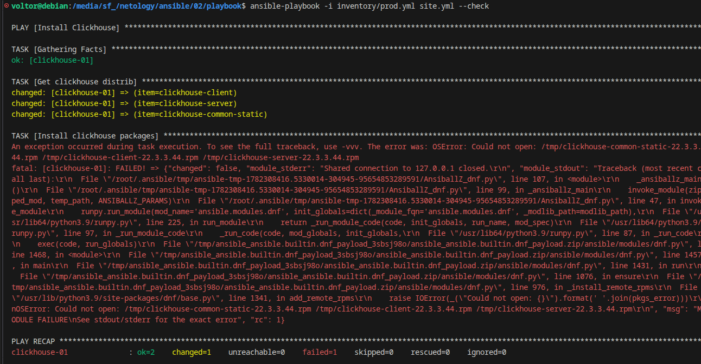
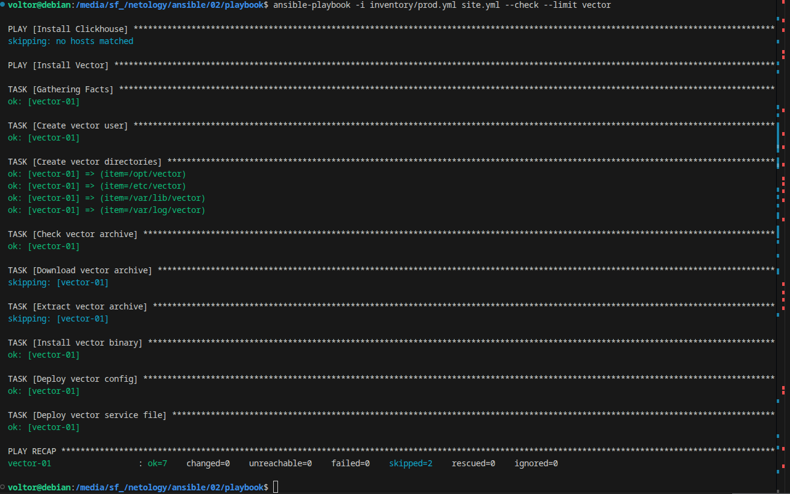
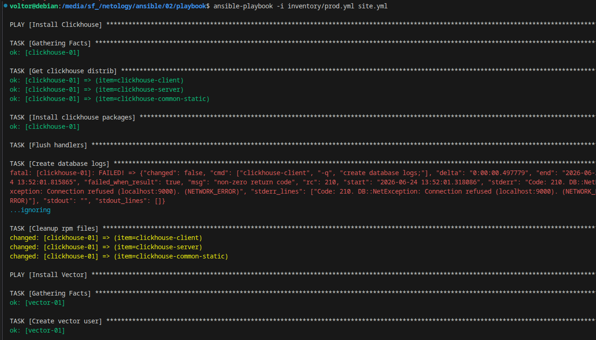
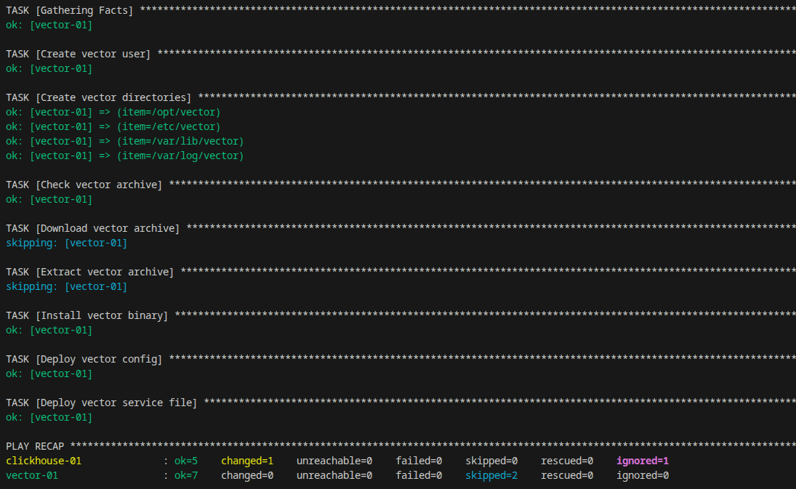
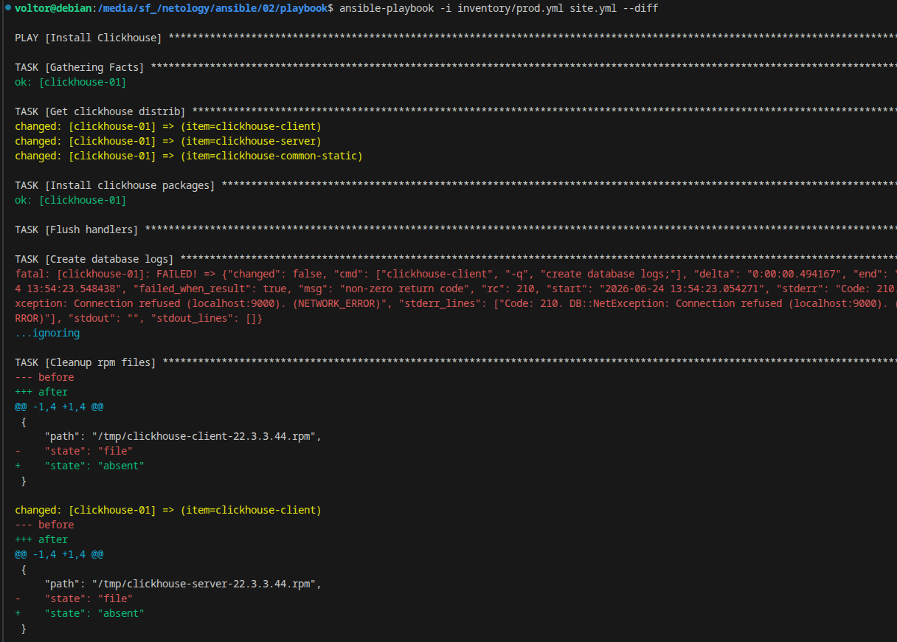
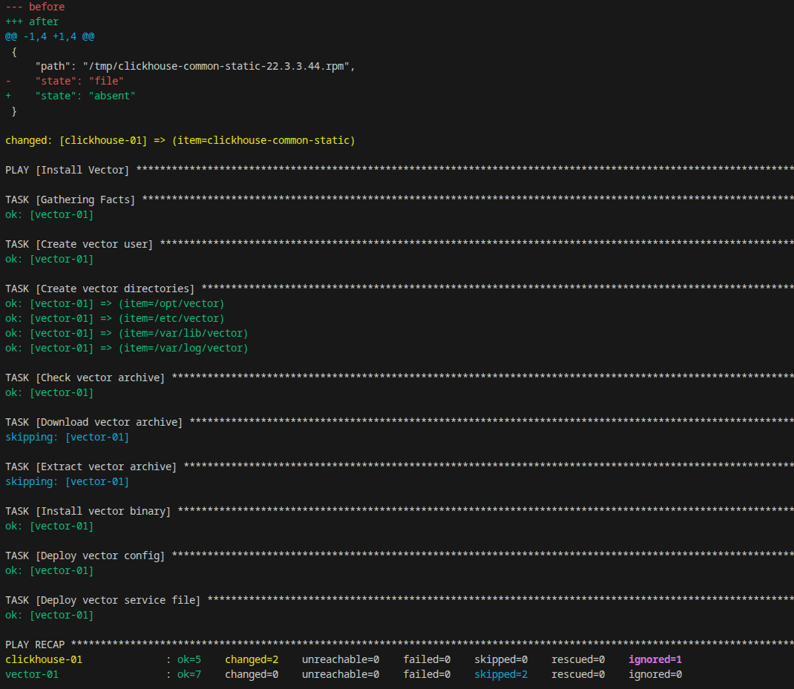
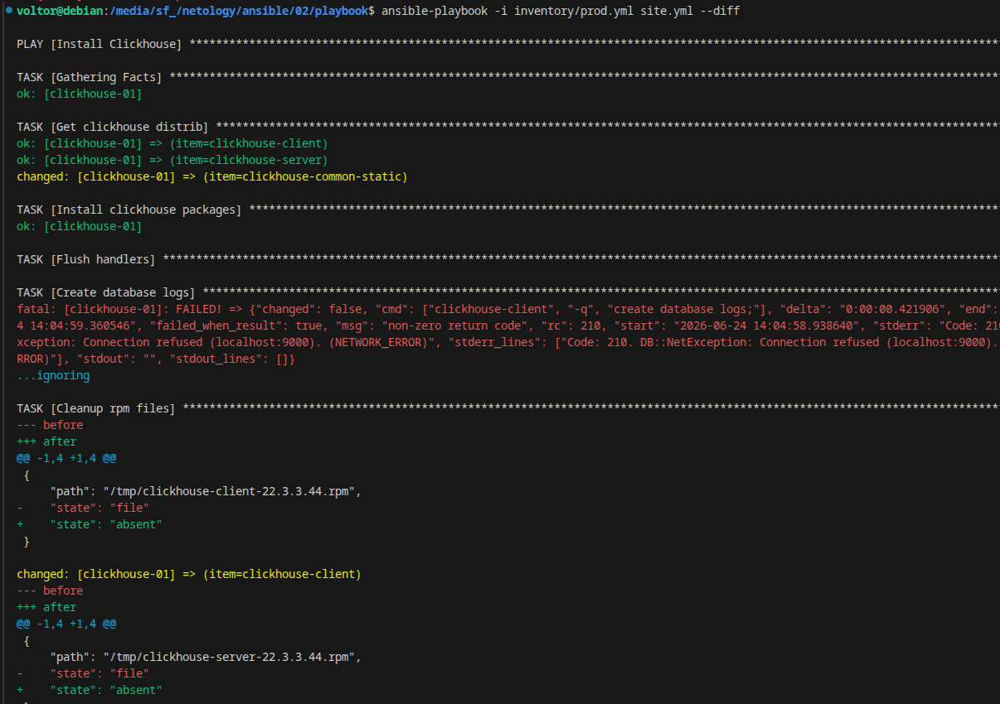
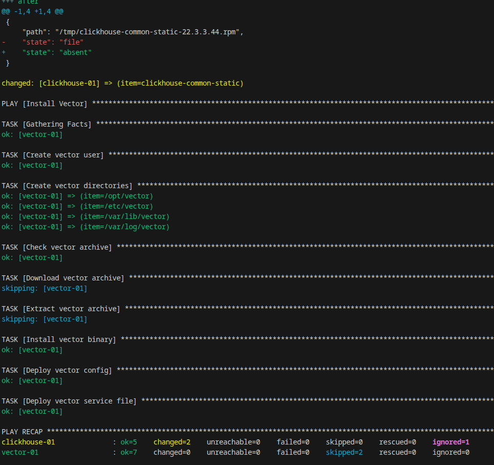

Домашнее задание к занятию «Ansible Playbook»
Описание

В рамках задания был разработан Ansible Playbook для автоматизации установки и настройки сервисов:

ClickHouse
Vector

Для тестирования использовалось Docker-окружение из трёх контейнеров:

Хост	Назначение
clickhouse-01	Сервер ClickHouse
vector-01	    Сервер Vector
lighthouse-01	Дополнительный хост

Структура проекта
.
playbook/ 
├── docker/ 
│ ├── clickhouse/ 
│ │ └── Dockerfile 
│ ├── ubuntu-host/ 
│ │ └── Dockerfile 
│ ├── clickhouse_data/ 
│ ├── vector_data/ 
│ ├── vector_logs/ 
│ └── docker-compose.yml 
├── group_vars/ 
│ ├── clickhouse/ 
│ │ └── vars.yml 
│ └── vector/ 
│ └── vars.yml 
├── inventory/ 
│ └── prod.yml 
├── templates/ 
│ ├── vector.service.j2 
│ └── vector.yml.j2 
└── site.yml

Возможности Playbook
ClickHouse

Playbook выполняет следующие действия:

скачивает RPM-пакеты ClickHouse;
устанавливает ClickHouse;
создаёт базу данных logs;
удаляет временные RPM-файлы после установки.
Vector

Playbook выполняет следующие действия:

создаёт системного пользователя Vector;
создаёт необходимые каталоги;
скачивает архив Vector;
распаковывает архив;
устанавливает бинарный файл Vector;
размещает конфигурационный файл;
размещает unit-файл сервиса.
Используемые переменные
ClickHouse
Переменная	        Описание
clickhouse_version	Версия ClickHouse
clickhouse_packages	Список устанавливаемых пакетов
Vector
Переменная	        Описание
vector_version	    Версия Vector
vector_arch	        Архитектура пакета
Инвентарь

Файл:

inventory/prod.yml

Пример запуска:

ansible-playbook -i inventory/prod.yml site.yml
Проверка синтаксиса

Проверка playbook выполняется командой:

ansible-lint site.yml

Результат:

Проверка режима Check

Команда:

  
  

При выполнении playbook с параметром --check задача установки ClickHouse завершается ошибкой:

OSError: Could not open: /tmp/clickhouse-common-static-22.3.3.44.rpm ...

Причина заключается в особенностях режима проверки Ansible. В режиме --check модуль get_url не скачивает RPM-пакеты фактически, а только сообщает о предполагаемых изменениях. Следующая задача установки пакетов пытается использовать файлы, которые отсутствуют в файловой системе, что приводит к ошибке.

Данное поведение является ожидаемым для режима проверки и связано с зависимостью между задачами скачивания и установки пакетов.
Для проверки идемпотентности Vector дополнительно использовалась команда:

Проверка изменений

Команда:

  
  

Режим --diff позволяет просмотреть изменения, которые вносит playbook.

  
  

Проверка идемпотентности

Повторный запуск:

  
  

Для роли Vector повторный запуск не приводит к изменениям, что подтверждает идемпотентность playbook.

ClickHouse скачивает RPM-пакеты во временный каталог /tmp и удаляются после установки. Поэтому при повторном запуске выполняется повторное скачивание пакетов, что отражается в количестве изменений.