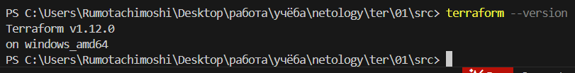
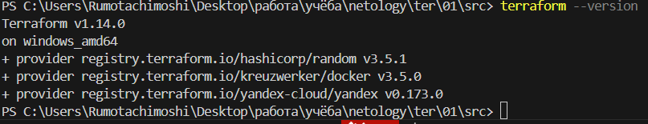
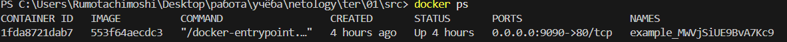
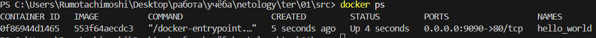
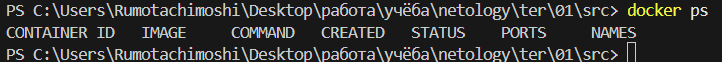
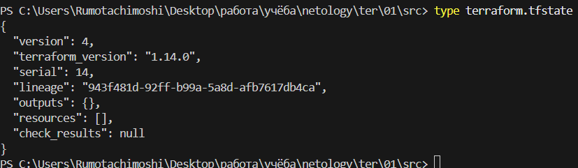
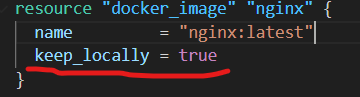

Задание 1.
1. Перейдите в каталог src. Скачайте все необходимые зависимости, использованные в проекте.
    >Скачал.
2. Изучите файл .gitignore. В каком terraform-файле, согласно этому .gitignore, допустимо сохранить личную, секретную информацию?(логины,пароли,ключи,токены итд)
    >Согласно .gitignore, личную и секретную информацию допустимо хранить в personal.auto.tfvars
3. Выполните код проекта. Найдите в state-файле секретное содержимое созданного ресурса random_password, пришлите в качестве ответа конкретный ключ и его значение.
    >"result": "MWVjSiUE9BvA7Kc9"
4. Раскомментируйте блок кода, примерно расположенный на строчках 29–42 файла main.tf. Выполните команду terraform validate. Объясните, в чём заключаются намеренно допущенные ошибки. Исправьте их.
    >1) Обновлена версия docker провайдера: ~> 3.0.1 → ~> 3.5.0 (решило проблему с API)
    >2) Отсутствовал провайдер random
        Было: В required_providers был только docker
        Стало: Добавлен random провайдер
    >3) Не был объявлен провайдер random
        Было: Только provider "docker" {}
        Стало: Добавлен provider "random" {}
    >4) Несовместимая версия Terraform
        Было: required_version = "~>1.12.0" (требует 1.12.0-1.12.x)
        Стало: required_version = ">=1.12.0" (любая версия от 1.12.0)
    >5) Ресурс docker_image без имени
        Было: resource "docker_image" { (нет имени)
        Стало: resource "docker_image" "nginx" { (добавлено имя)
    >6) Неправильное имя ресурса docker_container
        Было: resource "docker_container" "1nginx" (начинается с цифры)
        Стало: resource "docker_container" "nginx" (исправлено имя)
    >7) Неправильная ссылка на ресурс в интерполяции
        Было: random_password.random_string_FAKE.resulT
        Стало: random_password.random_string.result
    >8) Во время попыток решить проблемы, так же установил актуальную версию терраформ 
    
5. Выполните код. В качестве ответа приложите: исправленный фрагмент кода и вывод команды docker ps.
    ```
    terraform {
        required_providers {
            docker = {
                source  = "kreuzwerker/docker"
                version = "~> 3.5.0"
            }
            random = {
                source  = "hashicorp/random"
                version = "~> 3.5.1"
            }
            yandex = {
                source = "yandex-cloud/yandex"
            }
        }
        required_version = ">=1.12.0" /*Многострочный комментарий.
        Требуемая версия terraform */
    }
    provider "docker" {}
    provider "random" {}
    provider "yandex" {
        zone = "<зона_доступности_по_умолчанию>"
    }

    #однострочный комментарий

    resource "random_password" "random_string" {
        length      = 16
        special     = false
        min_upper   = 1
        min_lower   = 1
        min_numeric = 1
    }

    resource "docker_image" "nginx" {
        name         = "nginx:latest"
        keep_locally = true
    }

    resource "docker_container" "nginx" {
        image = docker_image.nginx.image_id
        name  = "example_${random_password.random_string.result}"

        ports {
            internal = 80
            external = 9090
        }
    }

    ```
    >
6. Замените имя docker-контейнера в блоке кода на hello_world. Не перепутайте имя контейнера и имя образа. Мы всё ещё продолжаем использовать name = "nginx:latest". Выполните команду terraform apply -auto-approve. Объясните своими словами, в чём может быть опасность применения ключа -auto-approve. Догадайтесь или нагуглите зачем может пригодиться данный ключ? В качестве ответа дополнительно приложите вывод команды docker ps.
    >-auto-approve это автоматическое подтверждение. Они могут привести к случайным изменениям, которые в свою очередь могут сломать что-то отдельное или вообще всё. Может создать дорогостоящие ресурсы. Можно остановить работающий сервис. Или можно случайно удалить ресурсы без предупреждения.
    >Может пригодиться в CI/CD, в скриптах, в тестовых окружениях, или при наличии исправных сценариев восстановления, но тоже с осторожностью.
    >
7. Уничтожьте созданные ресурсы с помощью terraform. Убедитесь, что все ресурсы удалены. Приложите содержимое файла terraform.tfstate.
    >
    >
8. Объясните, почему при этом не был удалён docker-образ nginx:latest. Ответ ОБЯЗАТЕЛЬНО НАЙДИТЕ В ПРЕДОСТАВЛЕННОМ КОДЕ, а затем ОБЯЗАТЕЛЬНО ПОДКРЕПИТЕ строчкой из документации terraform провайдера docker. (ищите в классификаторе resource docker_image )
    >Образ ngin:latest не удалился из-за параметра "keep_locally = true"
    >
    >