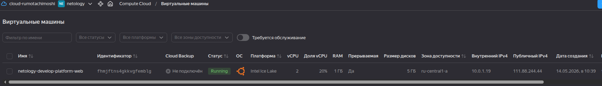
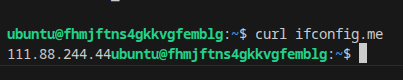
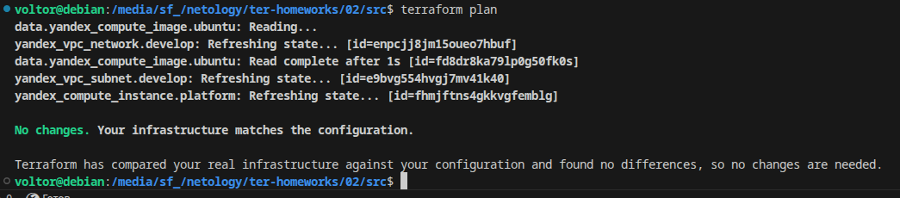
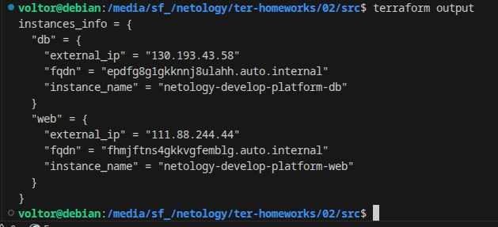
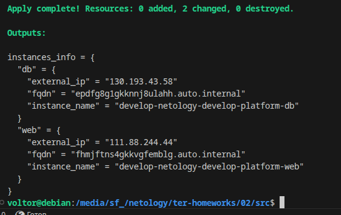
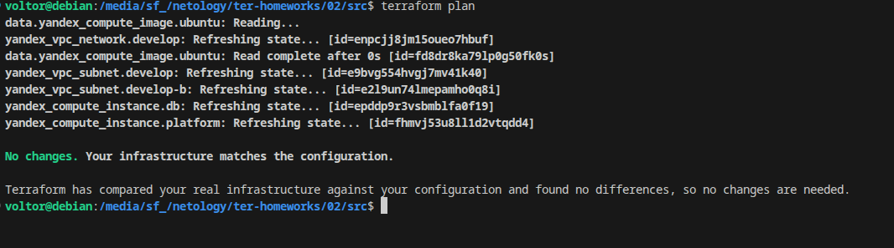

Задание 1.
1. скриншот ЛК Yandex Cloud с созданной ВМ, где видно внешний ip-адрес;  
>   
2. скриншот консоли, curl должен отобразить тот же внешний ip-адрес;  
>   
3. ответы на вопросы:  
    1. standart-v4 > standard-v3  
    2. Для платформы standard-v3 минимальное значение core_fraction — 20
    3. Платформа standard-v3 не поддерживает 1 ядро, по этому поставили 2  
    4. preemptible = true — делает ВМ прерываемой. Снижение стоимости ВМ что бы экономить ресурсы веделенных средств  
    5. core_fraction = 20 — низкая доля ядра (5% от физического ядра). тоже самое, во время учёбы не выбрать все выделенные ресурсы.  
  
Задание 2.  
>   
  
Задание 4.  
>   
  
Задание 5.  
>   
  
Задание 6.  
>   

Все файлы имеются в  ./src