Задание 1.  
Предоставьте скриншот подключения к консоли и вывод команды sudo nginx -t  
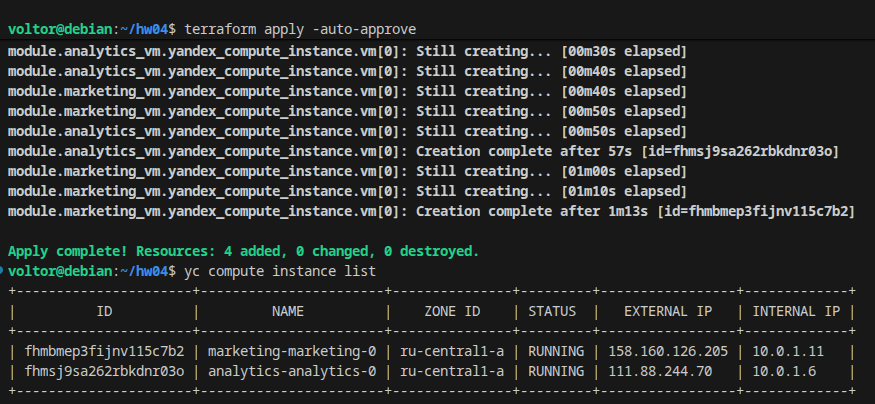  
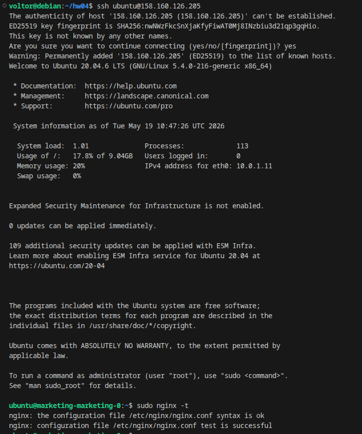  
скриншот консоли ВМ yandex cloud с их метками  
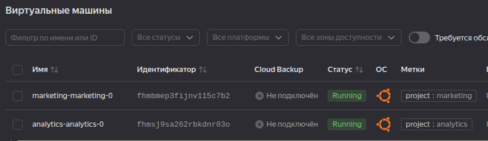  
terraform console и предоставьте скриншот содержимого модуля  
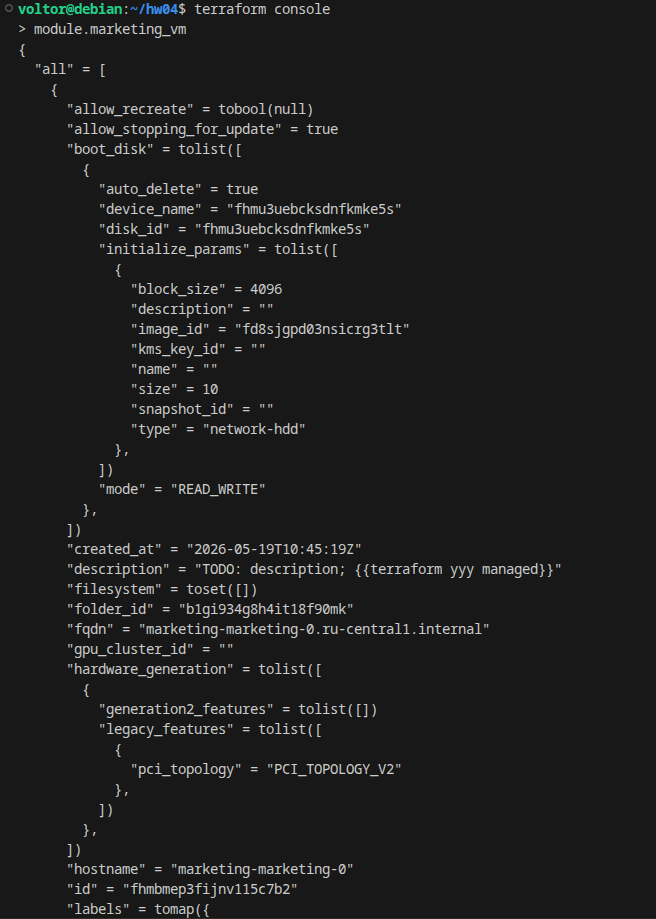  
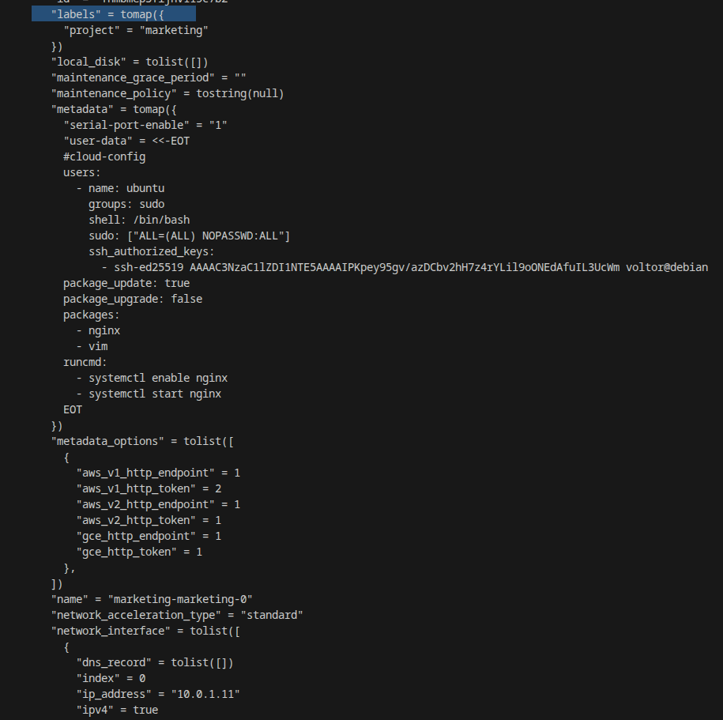  
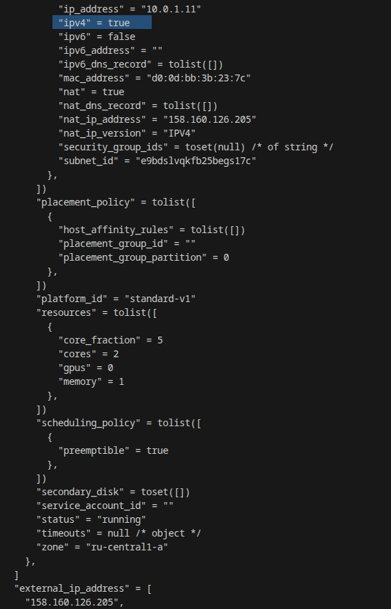  
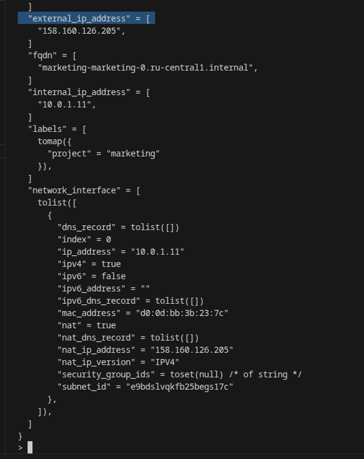  
  
Задание 2.  
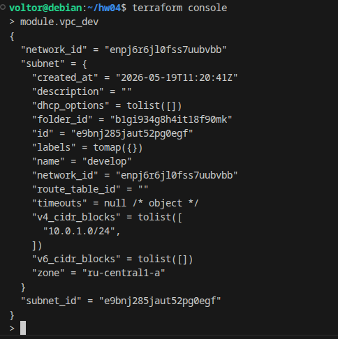  
Сгенерированная документация  
[README](src/vpc/README.md) 
  
Задание 3.  
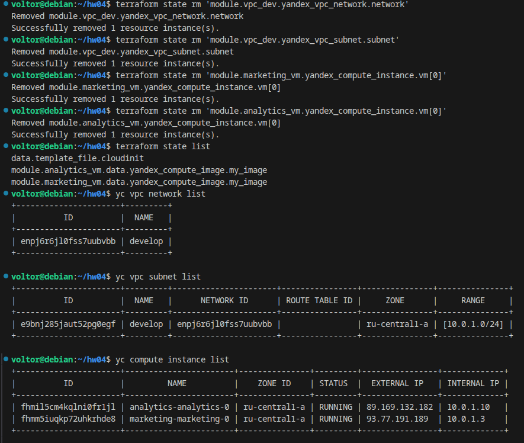  
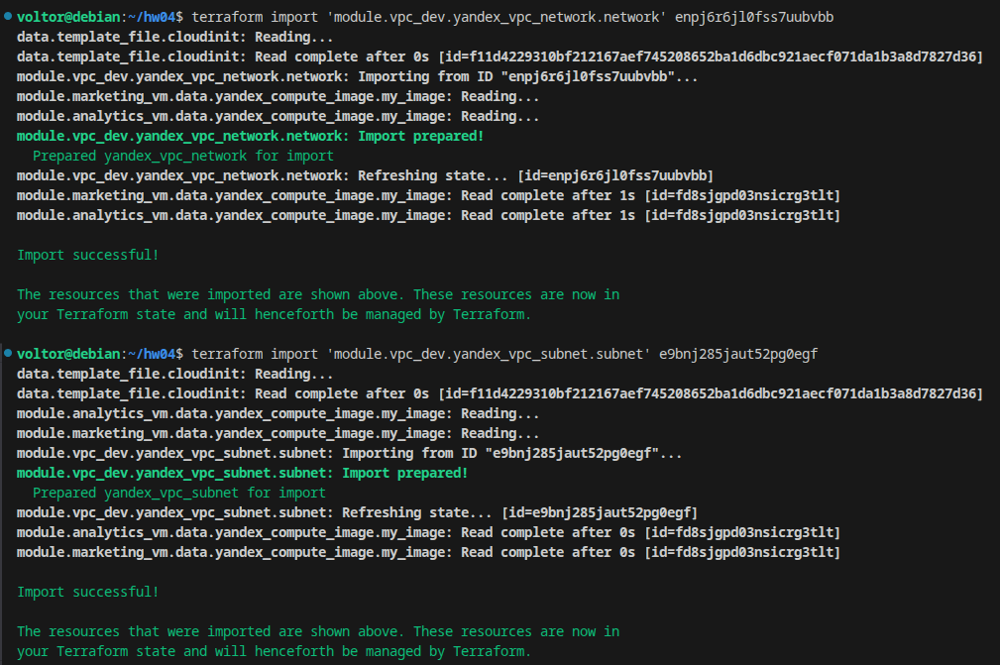  
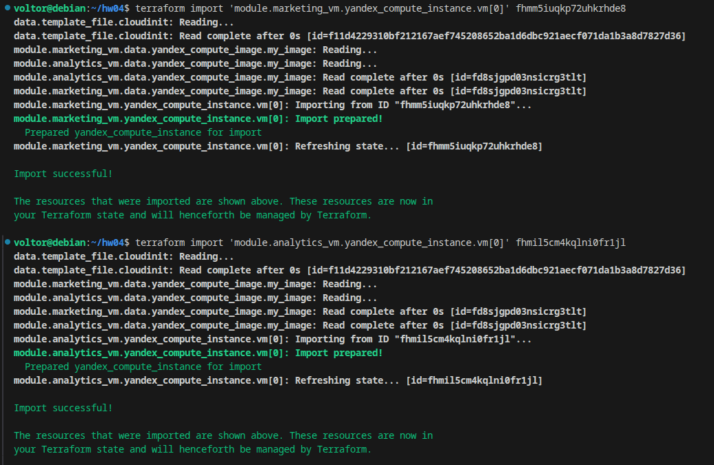  
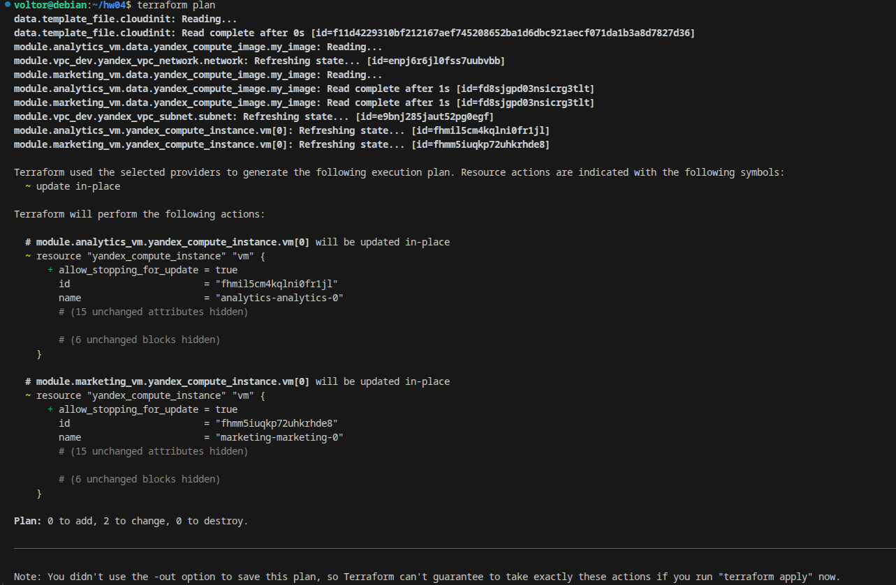  
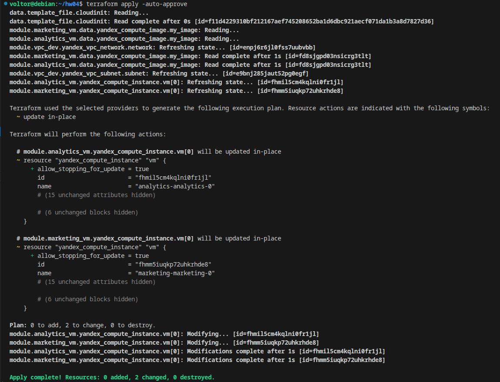  
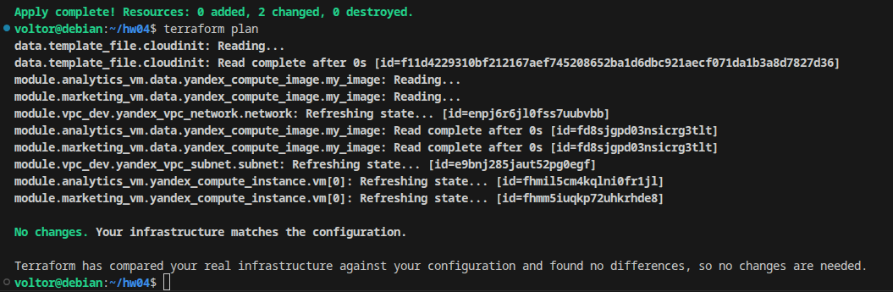
