1. Задача. https://hub.docker.com/repository/docker/rumotachimoshi/custom-nginx/general  
  
2. Задача. 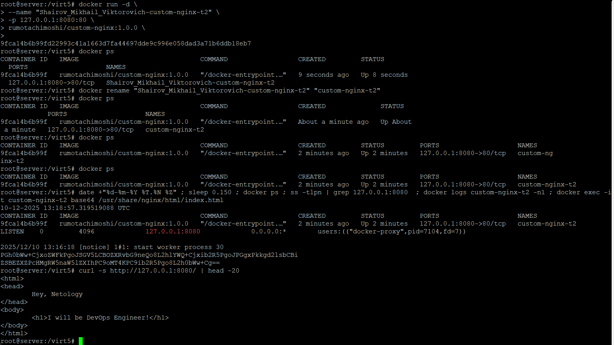  
  
3. Задача.    
    1. Воспользуйтесь docker help или google, чтобы узнать как подключиться к стандартному потоку ввода/вывода/ошибок контейнера "custom-nginx-t2".  
    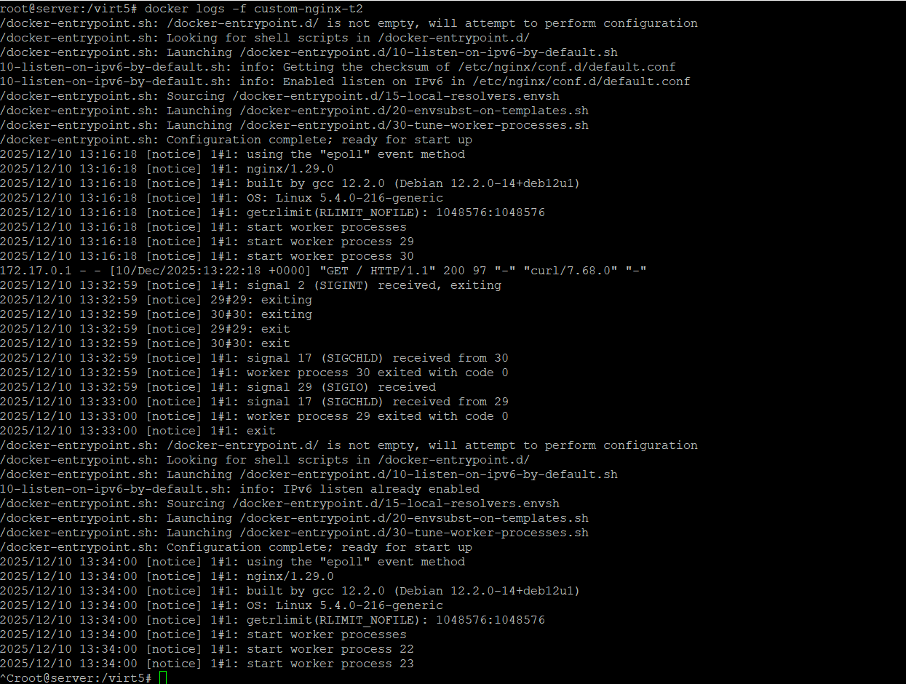  
    2. Подключитесь к контейнеру и нажмите комбинацию Ctrl-C.  
    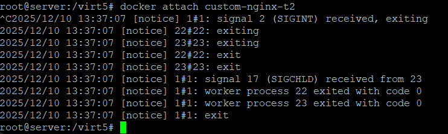  
    3. Выполните docker ps -a и объясните своими словами почему контейнер остановился.  
    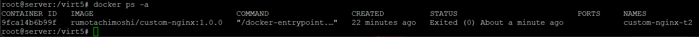  
    Контейнер остановился, потому что мы подключились к главному процессу, а сочетание клавиш CTRL+C послало команду остановить этот процесс. А когда останавливается главный процесс, docker автоматически останавливает весь контейнер, т.к. не осталось процессов для выполнения.  
    4. Перезапустите контейнер.  
    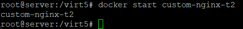  
    5. Зайдите в интерактивный терминал контейнера "custom-nginx-t2" с оболочкой bash.  
    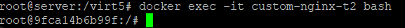  
    6. Установите любимый текстовый редактор(vim, nano итд) с помощью apt-get.  
    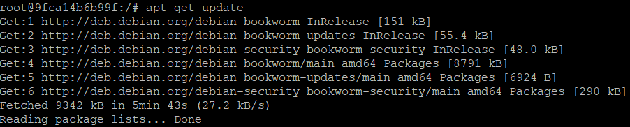  
    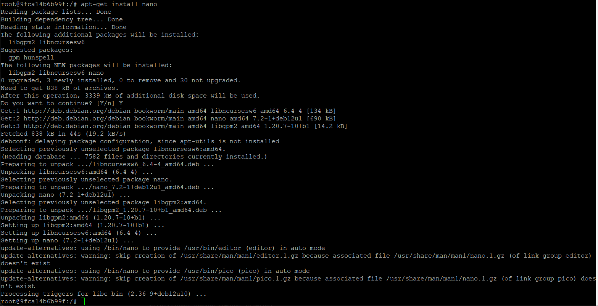  
    7. Отредактируйте файл "/etc/nginx/conf.d/default.conf", заменив порт "listen 80" на "listen 81".  
    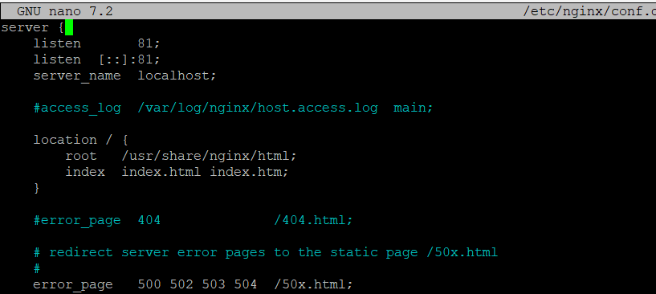  
    8. Запомните(!) и выполните команду nginx -s reload, а затем внутри контейнера curl http://127.0.0.1:80 ; curl http://127.0.0.1:81.  
    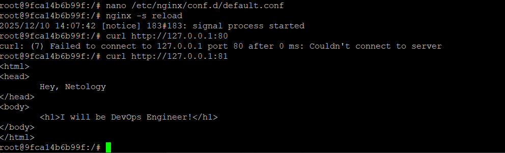  
    9. Выйдите из контейнера, набрав в консоли exit или Ctrl-D.  
    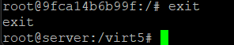  
    10. Проверьте вывод команд: ss -tlpn | grep 127.0.0.1:8080 , docker port custom-nginx-t2, curl http://127.0.0.1:8080. Кратко объясните суть возникшей проблемы.  
    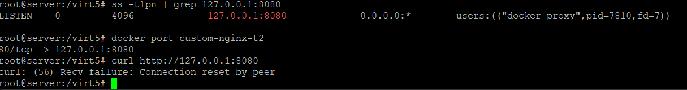  
    Суть проблемы. На хосте слушается порт 8080. Docker перенаправляет трафик с порта 8080 на порт 80 контейнера. Но nginx слушает порт в контейнере на 81.
    11. Это дополнительное, необязательное задание. Попробуйте самостоятельно исправить конфигурацию контейнера, используя доступные источники в интернете. Не изменяйте конфигурацию nginx и не удаляйте контейнер. Останавливать контейнер можно. пример источника.  
        a) Останавливаем контейнер и докер
        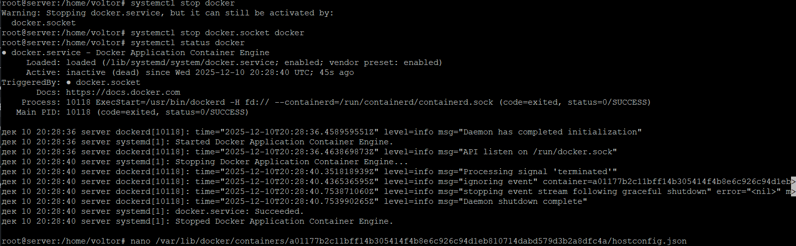  
        b) Меняем json файлы, запускаем докер и контейнер  
        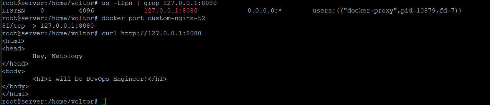  
        с) Проверяем  
        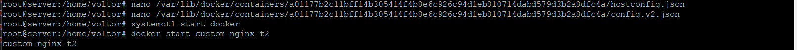  
    12. Удалите запущенный контейнер "custom-nginx-t2", не останавливая его.(воспользуйтесь --help или google).  
    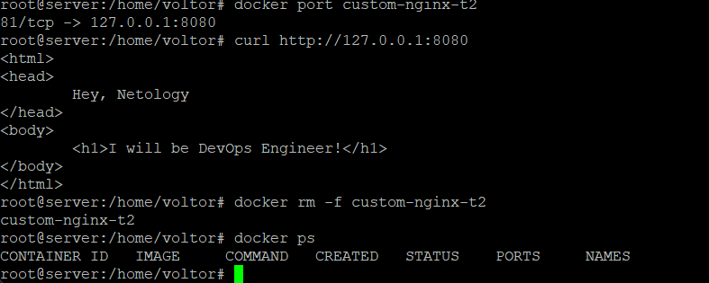

4. Задача.  
    1. Запустите первый контейнер из образа centos c любым тегом в фоновом режиме, подключив папку текущий рабочий каталог $(pwd) на хостовой машине в /data контейнера, используя ключ -v.  
    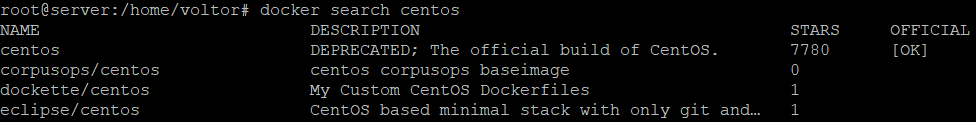  
      
    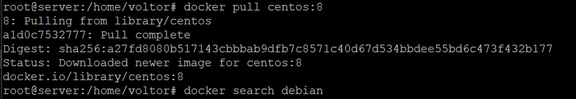  
    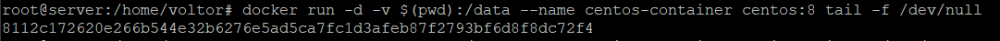  
    2. Запустите второй контейнер из образа debian в фоновом режиме, подключив текущий рабочий каталог $(pwd) в /data контейнера.  
    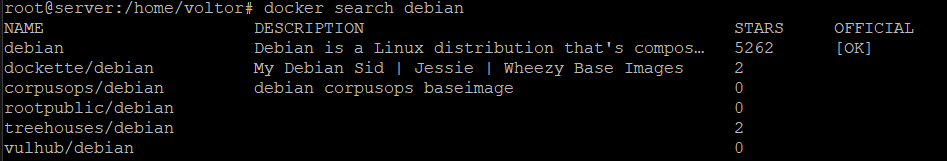  
    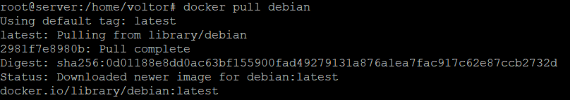  
    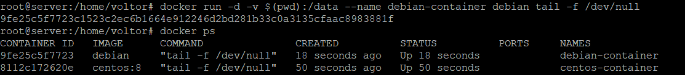  
    3. Подключитесь к первому контейнеру с помощью docker exec и создайте текстовый файл любого содержания в /data.  
      
    4. Добавьте ещё один файл в текущий каталог $(pwd) на хостовой машине.  
    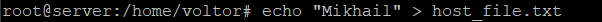  
    5. Подключитесь во второй контейнер и отобразите листинг и содержание файлов в /data контейнера.  
    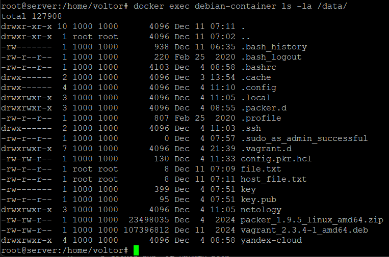  
5. Задача.
    1. Создайте отдельную директорию(например /tmp/netology/docker/task5) и 2 файла внутри него. "compose.yaml" и
    "docker-compose.yaml". И выполните команду "docker compose up -d". Какой из файлов был запущен и почему?.  
    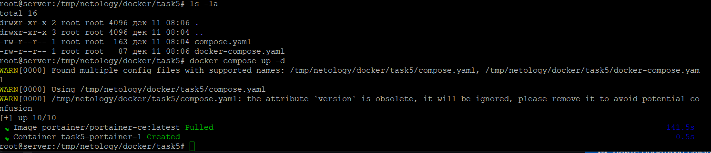  
    Запустился compouse.yaml, т.к. он более предпочтительный и используется по умолчанию в новых версиях. Файлы docker-compose.yaml поддерживаются для обратной совместимости. 
    2. Отредактируйте файл compose.yaml так, чтобы были запущенны оба файла.  
    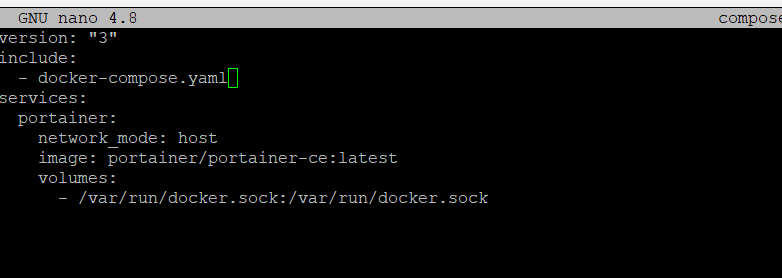  
    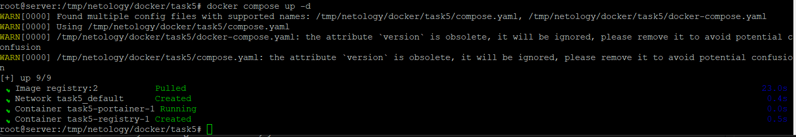  
    3. Выполните в консоли вашей хостовой ОС необходимые команды чтобы залить образ custom-nginx как custom-nginx:latest в запущенное вами, локальное registry.  
      
      
    4. Откройте страницу "https://127.0.0.1:9000" и произведите начальную настройку portainer.(логин и пароль адмнистратора).  
    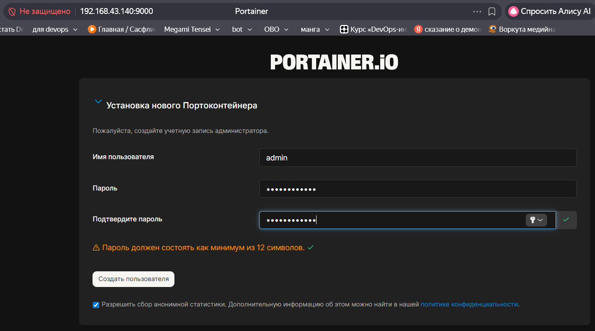  
    5. Откройте страницу "http://127.0.0.1:9000/#!/home", выберите ваше local окружение. Перейдите на вкладку "stacks" и в "web editor" задеплойте компоуз.  
    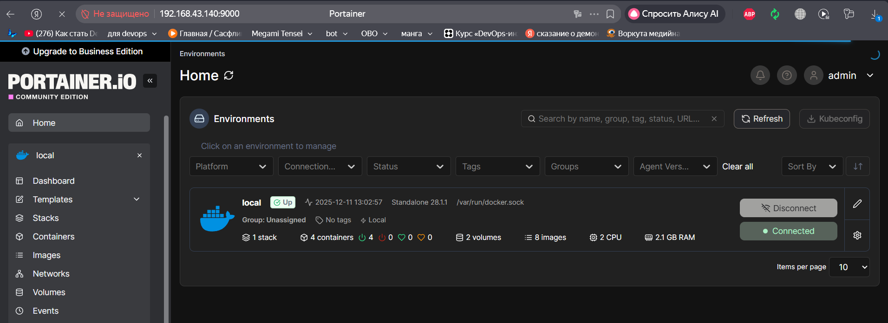  
    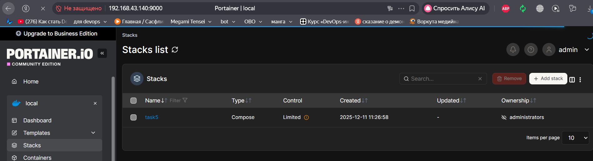  
    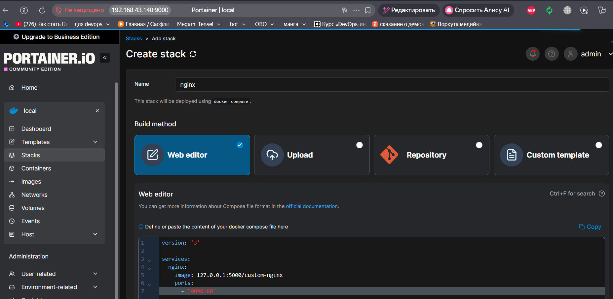  
    6. Перейдите на страницу "http://127.0.0.1:9000/#!/2/docker/containers", выберите контейнер с nginx и нажмите на кнопку "inspect". В представлении <> Tree разверните поле "Config" и сделайте скриншот от поля "AppArmorProfile" до "Driver".  
      
    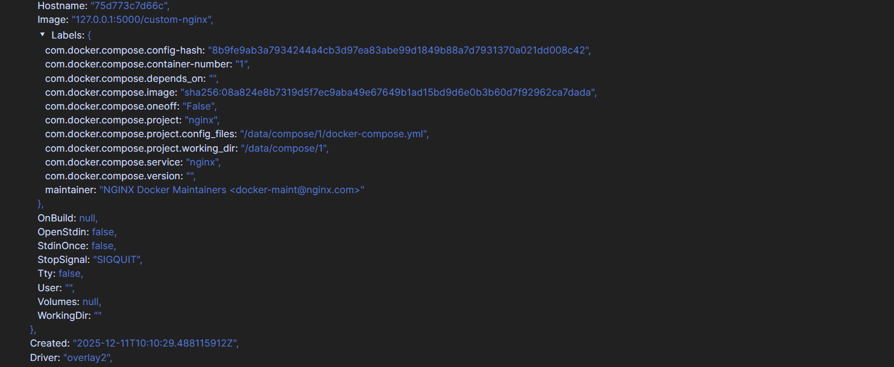  
    7. Удалите любой из манифестов компоуза(например compose.yaml). Выполните команду "docker compose up -d". Прочитайте warning, объясните суть предупреждения и выполните предложенное действие. Погасите compose-проект ОДНОЙ(обязательно!!) командой.  
    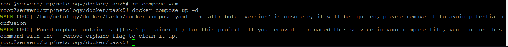  
    Тут 2 предупреждения. 1 - Атрибут version устарел. 2 - обнаружены контейнеры сироты? (не уверен насчёт правильности формулировки). Предлогается запустить команду с флагом --remove-orphans
    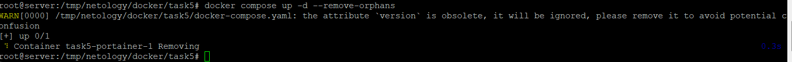  
    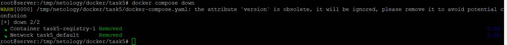  