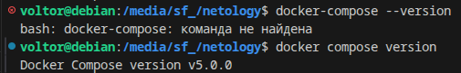
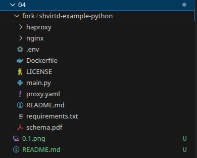
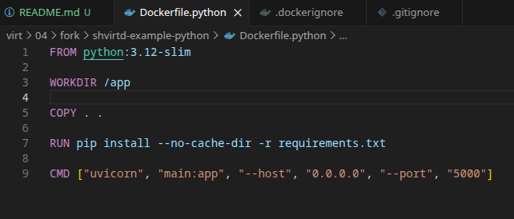
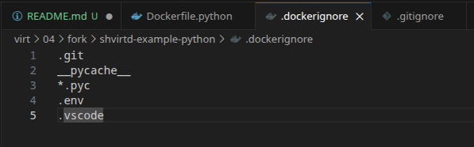
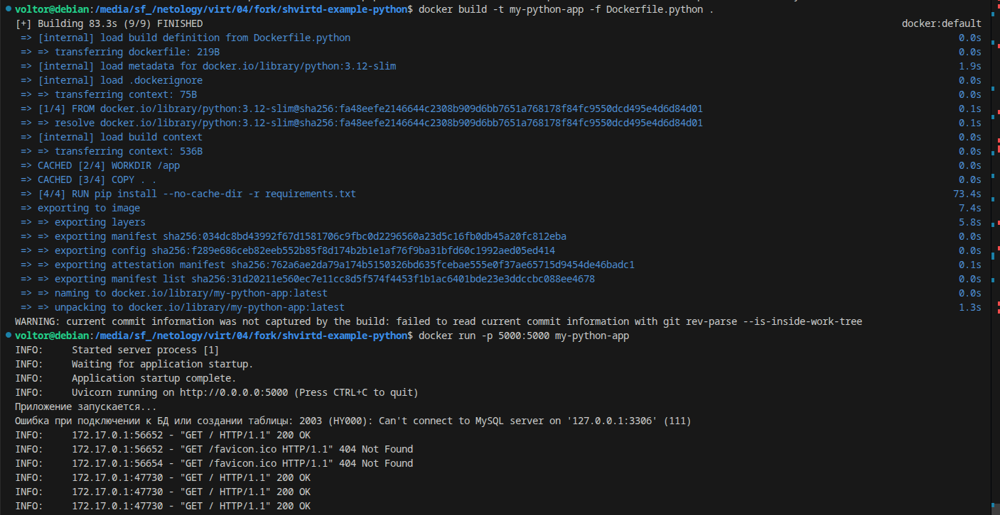
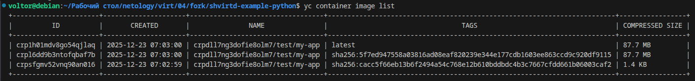
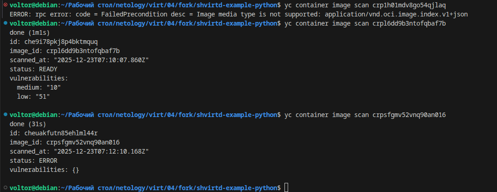
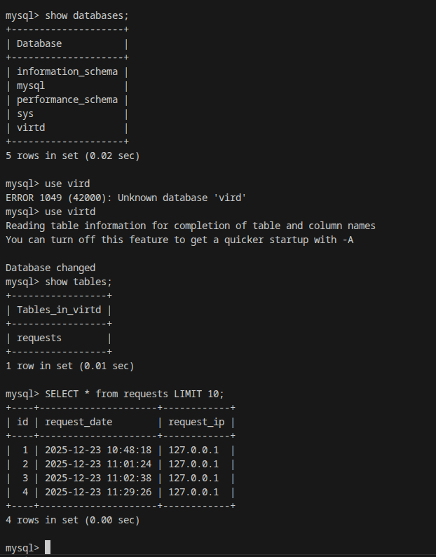

Задача 0.  
1. Убедитесь что у вас НЕ(!) установлен docker-compose, для этого получите следующую ошибку от команды docker-compose --version  
2. Убедитесь что у вас УСТАНОВЛЕН docker compose(без тире) версии не менее v2.24.X, для это выполните команду docker compose version  
  
  
Задача 1.  
1. Сделайте в своем GitHub пространстве fork репозитория.  
  
2. Создайте файл Dockerfile.python на основе существующего Dockerfile  
  
3. Создайте .dockerignore файл для исключения ненужных файлов  
  
4. Протестируйте корректность сборки  
  
  
Задача 2.  
Отчёт сканирования.  
  
  
  
Задача 3.  
В качестве ответа приложите скриншот sql-запроса.   
  

Задача 4.  
