Задача 0.  
1. Убедитесь что у вас НЕ(!) установлен docker-compose, для этого получите следующую ошибку от команды docker-compose --version  
2. Убедитесь что у вас УСТАНОВЛЕН docker compose(без тире) версии не менее v2.24.X, для это выполните команду docker compose version  
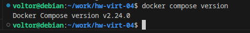  
  
Задача 1.  
1. Сделайте в своем GitHub пространстве fork репозитория.  
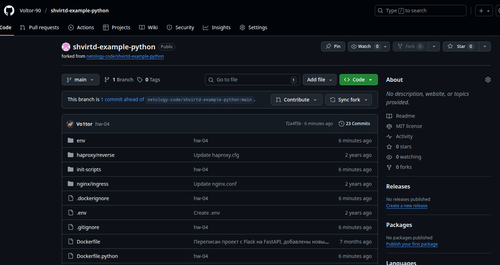  
2. Создайте файл Dockerfile.python на основе существующего Dockerfile  
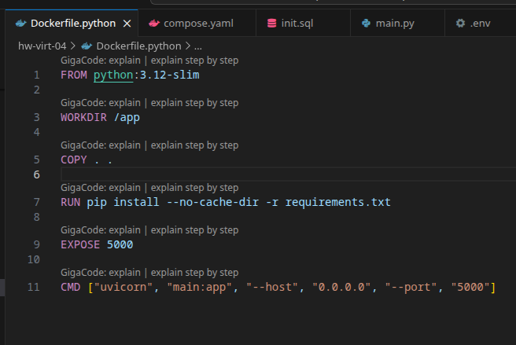  
3. Создайте .dockerignore файл для исключения ненужных файлов  
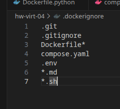  
4. Протестируйте корректность сборки  
  
  
Задача 3.  
compose.yaml  
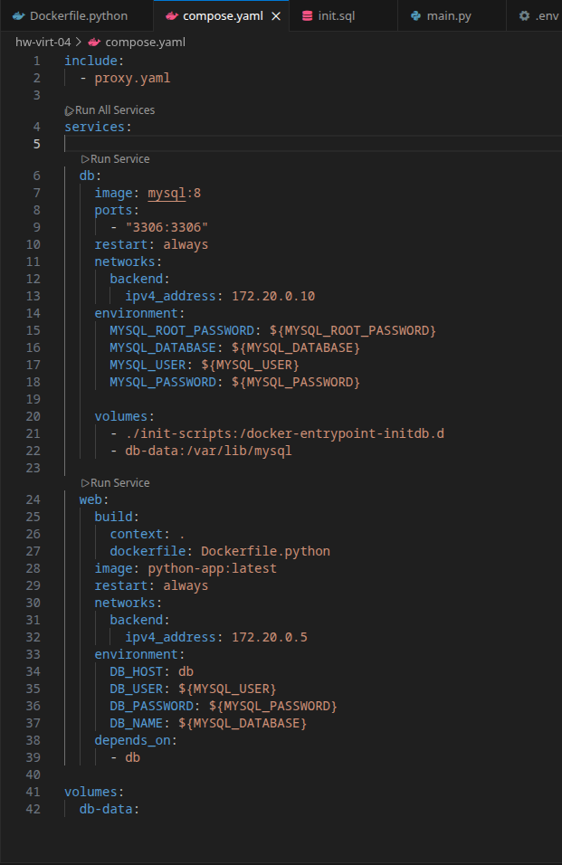  
для автоматического создания таблицы сделал init.sql  
я не нашёл способа автоматизировать этот процесс с заданными условиями (создать всего 5 указанных в задании файлов)  
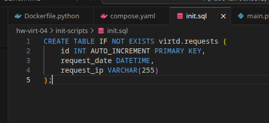  
SQL запросы  
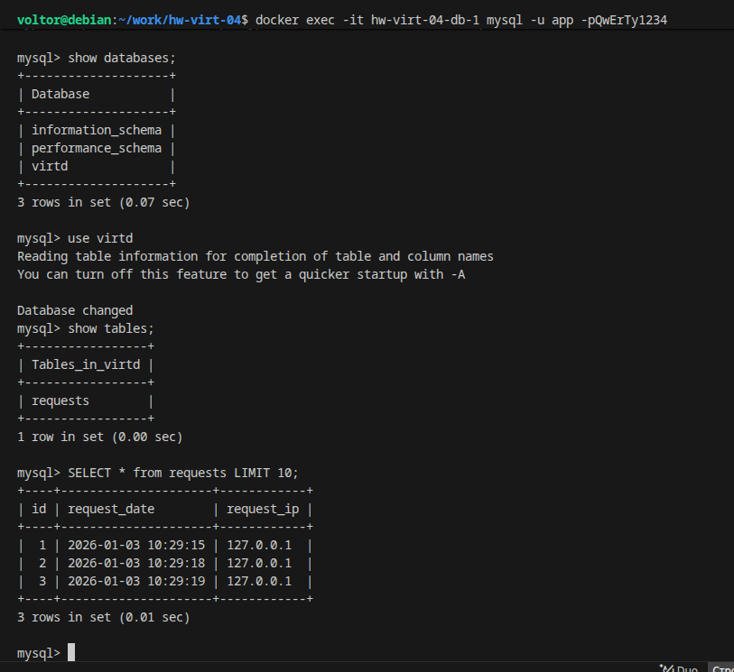  
  
Задача 4.
```  
#!/bin/bash

REPO_DIR="/opt/shvirtd-example-python"
REPO_URL="https://github.com/Voltor-90/shvirtd-example-python.git"

COMPOSE_FILE="$REPO_DIR/compose.yaml"

echo "Шаг 1. Проверка наличия репозитория в $REPO_DIR"

if [ ! -d "$REPO_DIR" ]; then
  echo "Репозиторий не найден. Клонирую из $REPO_URL..."
  sudo git clone "$REPO_URL" "$REPO_DIR"
  if [ $? -ne 0 ]; then
    echo "Ошибка при клонировании репозитория. Проверьте URL и подключение к GitHub."
    exit 1
  fi
else
  echo "Репозиторий найден. Перехожу в каталог..."
fi

echo "Шаг 2. Обновление кода из репозитория"
cd "$REPO_DIR" || { echo "Не удалось перейти в каталог $REPO_DIR"; exit 1; }


sudo git pull origin main
if [ $? -ne 0 ]; then
  echo "Ошибка при обновлении кода через git pull."
  exit 1
fi

echo "Шаг 3. Остановка существующих контейнеров (если есть)"
if [ -f "$COMPOSE_FILE" ]; then
  sudo docker compose -f "$COMPOSE_FILE" down -v
else
  echo "Файл compose.yaml не найден в $REPO_DIR. Проверьте путь."
  exit 1
fi

echo "Шаг 4. Сборка и запуск контейнеров"
sudo docker compose -f "$COMPOSE_FILE" up -d --build

if [ $? -eq 0 ]; then
  echo "✅ Проект успешно развёрнут!"
else
  echo "❌ Ошибка при запуске контейнеров. Проверьте compose.yaml и логи."
  exit 1
fi
```
  
Скриншот SQL запросов  
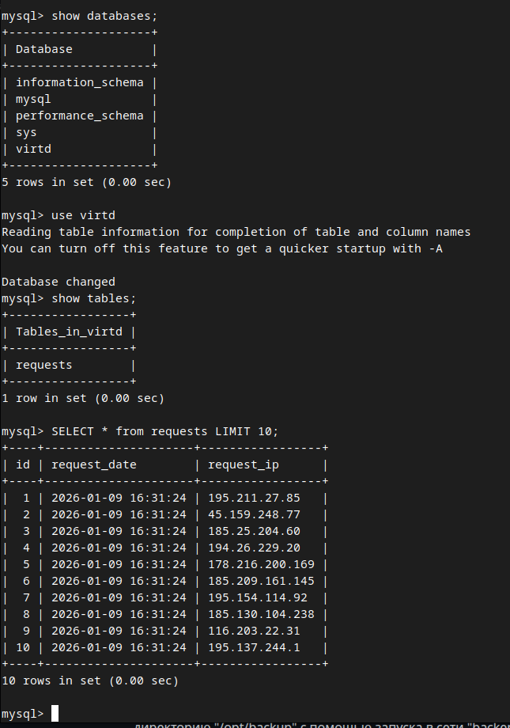  
  
Ссылка на репо: https://github.com/Voltor-90/shvirtd-example-python.git  

Задача 6.  
  
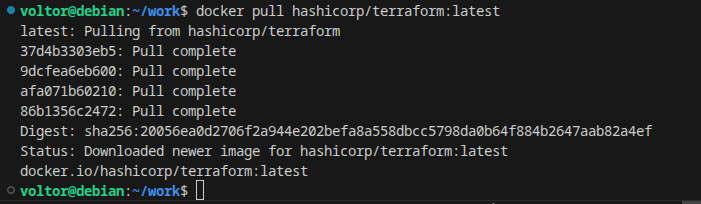  
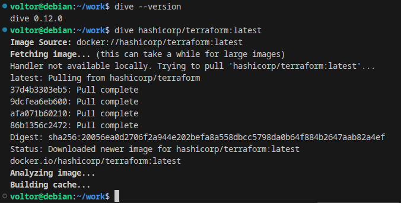  
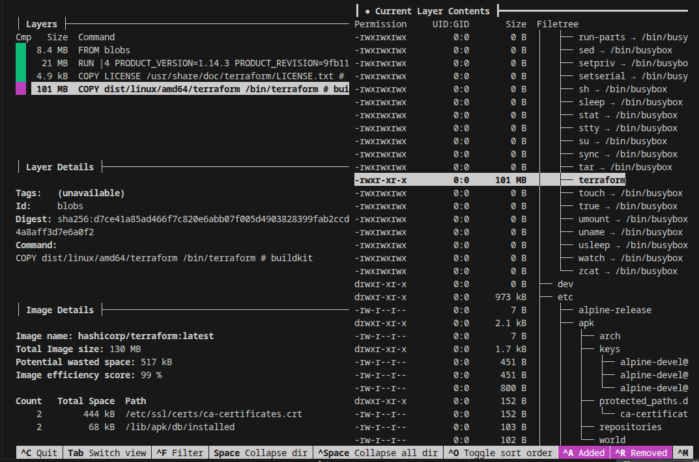  
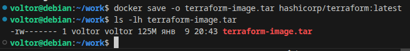  
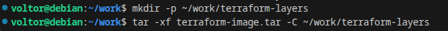  
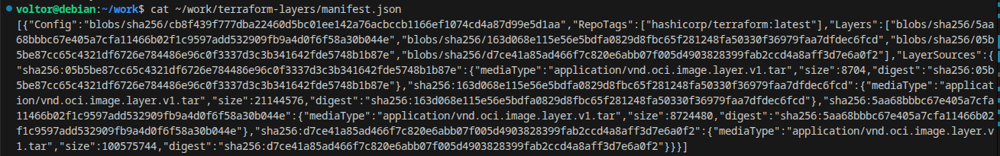  
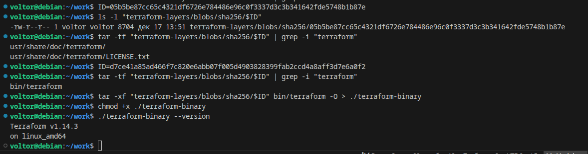  
  
Задача 6.1  
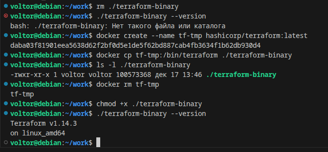  